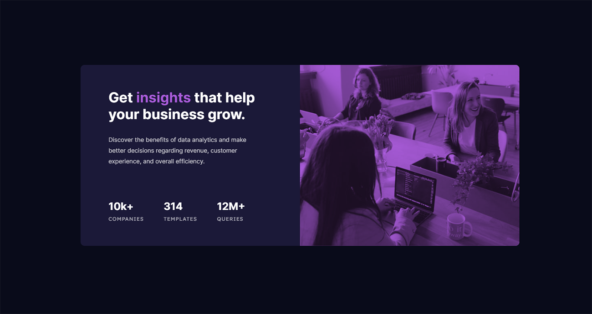

# Frontend Mentor - Stats preview card component solution

This is a solution to the [Stats preview card component challenge on Frontend Mentor](https://www.frontendmentor.io/challenges/stats-preview-card-component-8JqbgoU62). Frontend Mentor challenges help you improve your coding skills by building realistic projects. 

## Table of contents

- [Overview](#overview)
  - [The challenge](#the-challenge)
  - [Screenshot](#screenshot)
  - [Links](#links)
- [My process](#my-process)
  - [Built with](#built-with)
  - [What I learned](#what-i-learned)
  - [Continued development](#continued-development)
- [Author](#author)
- [Acknowledgments](#acknowledgments)

**Note: Delete this note and update the table of contents based on what sections you keep.**

## Overview

### The challenge

Users should be able to:

- View the optimal layout depending on their device's screen size

### Screenshot

### Links

- Solution URL: (https://github.com/tolgaozdemir/frontend-mentor-challenge-1)
- Live Site URL: (https://focused-bartik-b28126.netlify.app/)

## My process

### Built with

- Semantic HTML5 markup
- SASS
- Flexbox
- Desktop-first workflow

### What I learned

It's my first challange on Frontend Mentor and wanted to try Flexbox to make this responsive card layout. I learned how to make image files fully responsive, and found out how easy to resahape the layout with Flexbox.

### Continued development

I will master Flexbox with all the features it provides. I still have to do a lot more with media queries. I will definitely try mobile-first approach sometime .

## Author

- Website - [Tolga Özdemir]
- Frontend Mentor - [@tolgaozdemir](https://www.frontendmentor.io/profile/tolgaozdemir)
- Twitter - [@tolga_ozd](https://www.twitter.com/tolga_ozd)

## Acknowledgments

I took Advanced CSS course at Udemy from Jonas Schmedtmann. I recomment his courses if anyone is interested in learning more about web development.
https://www.udemy.com/user/jonasschmedtmann/
